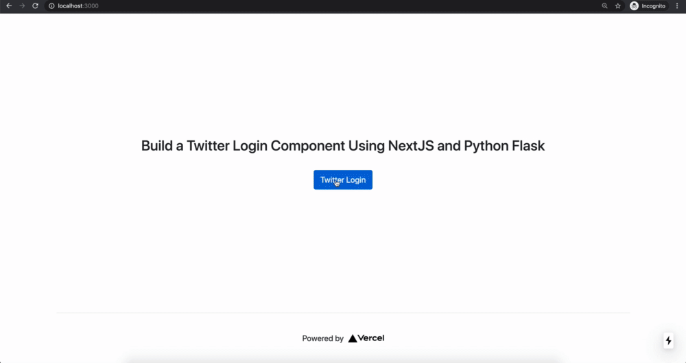
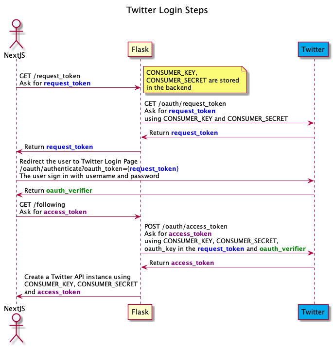

# NextJS & Flask Twitter Login

Build a Twitter Authentication flow using NextJS and Python Flask. The full tutorial is on my Medium post.

## Preview



## Architecture




## Development

### Flask App

```
cd flask
virtualenv venv
source venv/bin/activate
pip install -r requirement.txt
```

### NextJS App

```
npm install
npm run dev
```


